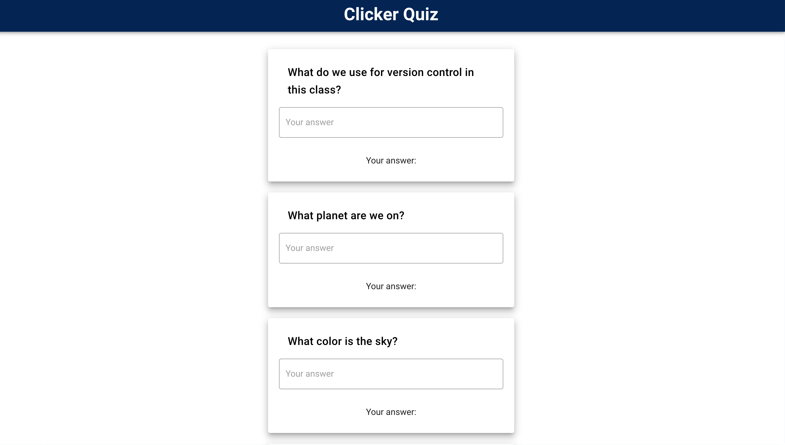

# ClickerQuiz

Comp 330 project 

This is an in-class project where we create a quiz in order to, ultimately, help teachers and students. The questions are straightforward and are meant to be silly. In the near future, we will be creating a client/server system where instructors will be able to run a server that the students will take the quiz on. Stay tuned!




## Installation instructions

An installation video demo is available under the announcements section for our group on [youtube](https://www.youtube.com/watch?v=uRLDisjbjMY240064929).

To run locally:

```
git clone https://github.com/alexandratcrane/ClickerQuiz.git 
```

After cloning, cd into the repository

```
cd clicker-app
```

```
npm install
```

```
npm run serve
```

after that, the server should be up and running at the default port [localhost:8080](http://localhost:8080/) 


## Built With

* Vuejs CLI 3


## Authors
###Phase 1
* **Alexandra Crane** - [github](https://github.com/alexandratcrane)

* **Paulina Adamski** - [github](https://github.com/paulinusia)

###Phase 2
* **Alexandra Crane** - [github](https://github.com/alexandratcrane)

* **Paulina Adamski** - [github](https://github.com/paulinusia)

* **Jack Brooks** - [github](https://github.com/jbrooks11)

* **Alex Rose** - [github](https://github.com/acrose99)


## Acknowledgments and sources used

*  [vuetify documentation](https://vuetifyjs.com/en/getting-started/quick-start)
* [vuejs get help forums](https://forum.vuejs.org/t/cannot-read-property-of-undefined-yet-the-data-is-displayed/15494/5)
* [vue documentation for the CLI](https://vuejs.org/v2/guide/components.html)
* [stackoverflow](https://stackoverflow.com/questions/34865348/vuejs-set-a-radio-button-checked-if-statement-is-true)
* [JSON instructions](https://www.w3schools.com/js/js_json_intro.asp)

